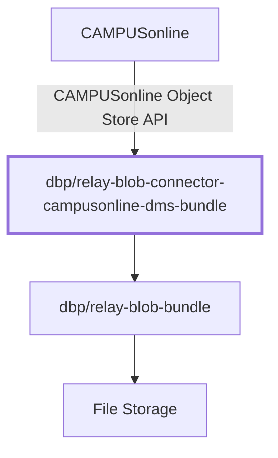

# DbpRelayBlobConnectorCampusonlineDmsBundle

[GitHub](https://github.com/digital-blueprint/relay-blob-connector-campusonline-dms-bundle) |
[Packagist](https://packagist.org/packages/dbp/relay-blob-connector-campusonline-dms-bundle)

The `dbp/relay-blob-connector-campusonline-dms-bundle` is a Symfony bundle that
provides a connector for the
[dbp/relay-blob-bundle](https://packagist.org/packages/dbp/relay-blob-bundle) to
the "CAMPUSonline Object Store API" and allows CO to store files in
blob.

See the [documentation](./docs/README.md) for more information.
