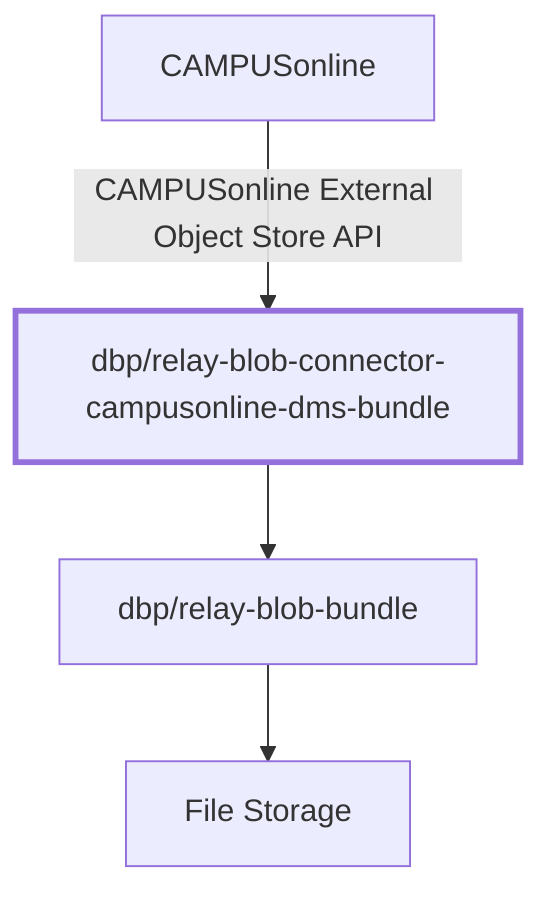

# Overview

The `dbp/relay-blob-connector-campusonline-dms-bundle` is a Symfony bundle that
provides a connector for the
[dbp/relay-blob-bundle](https://packagist.org/packages/dbp/relay-blob-bundle) to
the "CAMPUSonline External Object Store API" and allows CO to store files in
blob.

## Documentation

* [Bundle Configuration](./config.md)
* [Provided API](./api.md)